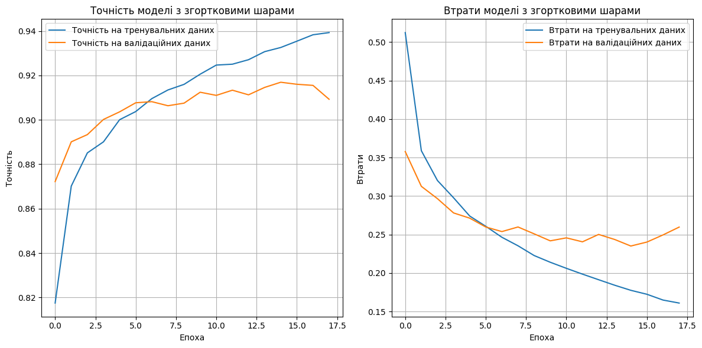
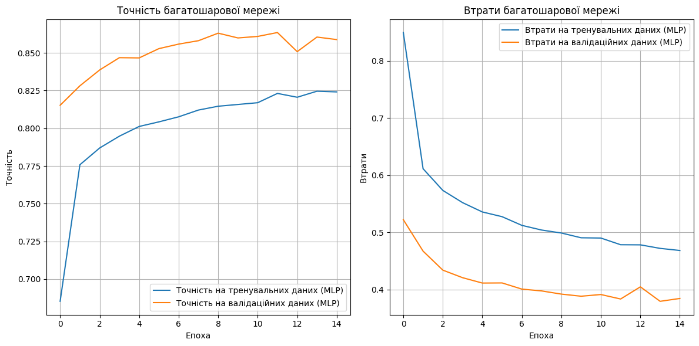
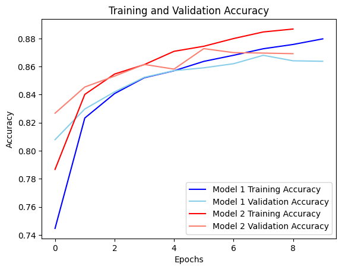
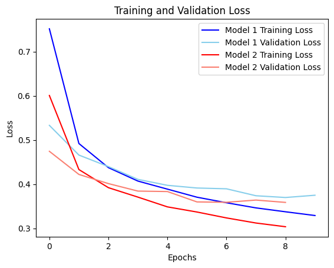

# HW_DATA_10
# ***Частина 1***

*​В якості домашнього завдання вам пропонується створити нейронну мережу за допомогою механізмів Keras, яка буде класифікувати товари із датасету fasion_mnist.*

*На відміну від попереднього завдання вам пропонується створити згорткову нейромережу. Підберіть архітектуру мережі та навчіть її на даних із датасету fasion_mnist. Спробуйте досягти максимально можливої точності класифікації за рахунок маніпуляції параметрами мережі. Порівняйте точність отриманої згорткової мережі з точністю багатошарової мережі з попереднього завдання.* 
**Зробіть висновки**

# За даними можна зробити наступні висновки:

* Згорткова мережа досягла високої точності на тестових даних
у розмірі 91.54%, що свідчить про її добру універсальність на нових, раніше не бачених даних.

* Точність на тренувальних даних для згорткової мережі становить 94.89%, що свідчить про високу здатність моделі підлаштовуватися під тренувальні дані.

* Час тренування згорткової мережі становить 7 хвилин, що є прийнятним для такого рівня точності та складності моделі.

* Багатошарова мережа також досягла досить високої точності на тестових даних у розмірі 85.59%, але менше, ніж згорткова мережа.

* Точність на тренувальних даних для багатошарової мережі складає 86.79%, що може свідчити про перенавчання моделі або про меншу здатність моделі адаптуватися до нових даних.

* Час тренування багатошарової мережі значно менший - лише 1 хвилина, що може бути перевагою у випадках, коли важливий час тренування.

Отже, згорткова мережа демонструє кращі результати як у точності, так і у здатності універсального застосування на нових даних, але вона вимагає більше часу для тренування порівняно з багатошаровою мережею, яка, у свою чергу, має меншу точність.

# ***Частина 2***

В цій частині ми знову будемо працювати з датасетом fasion_mnist.

На відміну від попереднього завдання вам пропонується створити згорткову нейромережу, що використовує VGG16 в якості згорткової основи.

Навчіть отриману мережу на даних із датасету fasion_mnist. Спробуйте досягти максимально можливої точності класифікації за рахунок маніпуляції параметрами мережі. Під час навчання використовуйте прийоми донавчання та виділення ознак.

Порівняйте точність отриманої згорткової мережі з точністю багатошарової мережі з попереднього завдання. Зробіть висновки.

***Висновок***

Використання моделі VGG16 може бути вимогливим з точки зору обчислювальних ресурсів. Без використання T4 ця модель може бути недоступною. Хоча застосування різних методів для покращення результатів може призвести до невеликого підвищення точності на 1-2%, проте цей приріст не є значним. При виборі методів для розв'язання завдань завжди слід керуватися розумінням того, що якщо потрібна точність вже досягнута, необов'язково вибирати більш складні методи, які можуть вимагати значних обчислювальних та часових ресурсів, але не суттєво поліпшити результати.
